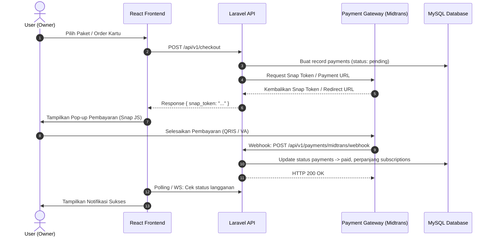
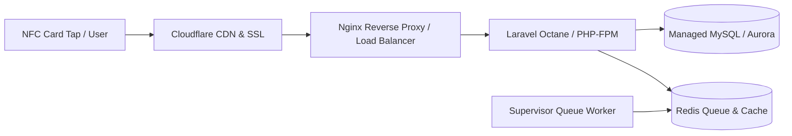

# ReviewTap — Panduan Implementasi Phase 2 (Scale, React & Headless API)

Dokumen ini merupakan panduan arsitektur dan pengembangan lanjutan (**Phase 2**) untuk platform **ReviewTap**. Phase 2 berfokus pada modernisasi frontend ke **React**, pembukaan **RESTful API**, otomatisasi payment gateway, aktivasi fitur *deferred* (custom domain, webhooks, audit log, notifikasi), serta skalabilitas infrastruktur cloud.

---

## Daftar Isi
1. [Visi & Tujuan Phase 2](#1-visi--tujuan-phase-2)
2. [Pilihan Arsitektur Frontend: Inertia.js vs Pure Headless (Next.js / Vite SPA)](#2-pilihan-arsitektur-frontend-inertiajs-vs-pure-headless)
3. [Arsitektur RESTful API & Keamanan (Laravel Sanctum)](#3-arsitektur-restful-api--keamanan-laravel-sanctum)
4. [Skema Database Lanjutan (Aktivasi Deferred Tables)](#4-skema-database-lanjutan-aktivasi-deferred-tables)
   - 4.1 Custom Domains (`custom_domains`)
   - 4.2 Webhooks & Integrasi CRM (`webhooks`, `webhook_deliveries`)
   - 4.3 Audit Logs (`audit_logs`)
   - 4.4 Notifikasi Real-time & WhatsApp Alert (`notifications`)
   - 4.5 E-Commerce Pemesanan Kartu (`orders`, `order_items`, `coupons`)
5. [Otomatisasi Payment Gateway (Midtrans / Xendit)](#5-otomatisasi-payment-gateway-midtrans--xendit)
6. [Fitur Custom Domain (White-Label Tenant)](#6-fitur-custom-domain-white-label-tenant)
7. [Smart Notification Engine (Alert Rating Rendah Instan)](#7-smart-notification-engine-alert-rating-rendah-instan)
8. [Analitik Lanjutan & Agregasi Data (Redis Caching)](#8-analitik-lanjutan--agregasi-data-redis-caching)
9. [Katalog Endpoint REST API (v1)](#9-katalog-endpoint-rest-api-v1)
10. [Implementasi Client React (Contoh Komponen Interaktif)](#10-implementasi-client-react-contoh-komponen-interaktif)
11. [Migrasi Infrastruktur: Dari Shared Hosting ke VPS/Cloud](#11-migrasi-infrastruktur-dari-shared-hosting-ke-vpscloud)

---

## 1. Visi & Tujuan Phase 2

Pada Phase 1 (MVP), ReviewTap berhasil memvalidasi:
- Tap NFC/QR menuju landing review.
- Smart routing rating: 1–3 ke WhatsApp, 4–5 ke Google Review.
- Manajemen multi-tenant dasar via Blade + Tailwind.

**Target Utama Phase 2:**
1. **Frontend Terpisah (React)**: Pengalaman pengguna yang sangat cepat, animasi interaktif tingkat tinggi, dan kemudahan build mobile app (PWA / React Native) di kemudian hari.
2. **Automated Monetization**: Pembayaran langganan SaaS & pembelian kartu NFC fisik otomatis via Payment Gateway (Midtrans / Xendit).
3. **White-label / Custom Domain**: Tenant dapat menggunakan domain sendiri (contoh: `review.floreancafe.com`).
4. **CRM & Notifikasi Instan**: Pemilik bisnis mendapatkan notifikasi instan (WhatsApp / Telegram) saat ada feedback buruk (1–3 bintang).
5. **Skalabilitas**: Pemisahan antrian background job dan caching analitik menggunakan Redis.

---

## 2. Pilihan Arsitektur Frontend: Inertia.js vs Pure Headless

Terdapat 2 opsi arsitektur React di Phase 2:

```mermaid
graph TD
    subgraph Opsi 1: Inertia.js Monolith
        A1[Laravel Backend] <-->|Inertia Protocol| B1[React Dashboard / Pages]
        A1 --> DB1[(MySQL)]
    end

    subgraph Opsi 2: Pure Headless (Rekomendasi Skala Besar)
        A2[Client 1: React Review Landing SPA] -->|JSON API v1| C[Laravel REST API]
        A22[Client 2: React Dashboard / Next.js] -->|JSON API v1| C
        A23[Client 3: Mobile Apps / PWA] -->|JSON API v1| C
        C --> DB2[(MySQL)]
        C --> R2[(Redis Cache & Queue)]
    end
```

### Rekomendasi ReviewTap Phase 2: **Pure Headless (Opsi 2)**
- **Public Review Page & Tap Resolver**: Tetap ringan dan super cepat. Bisa menggunakan React SPA atau Next.js untuk SEO dan dynamic OpenGraph cards saat link dibagikan di media sosial.
- **Admin Dashboard**: React + Vite (atau Next.js) dengan Tailwind CSS + Shadcn UI.
- **Backend**: Laravel murni sebagai API Engine (`routes/api.php`).

---

## 3. Arsitektur RESTful API & Keamanan (Laravel Sanctum)

### 3.1 Autentikasi dengan Laravel Sanctum
Sanctum mendukung 2 mode sekaligus:
1. **SPA Cookie-based Session**: Untuk React Dashboard jika berada di domain/subdomain yang sama (e.g. `app.reviewtap.id` dan `api.reviewtap.id`).
2. **Bearer Token**: Untuk aplikasi mobile atau integrasi pihak ketiga.

```php
// config/sanctum.php
'stateful' => explode(',', env('SANCTUM_STATEFUL_DOMAINS', sprintf(
    '%s%s',
    'localhost,localhost:3000,127.0.0.1,127.0.0.1:8000,::1',
    env('APP_URL') ? ','.parse_url(env('APP_URL'), PHP_URL_HOST) : ''
))),
```

### 3.2 Standarisasi Response API (Envelope Pattern)
Buat trait response di `app/Traits/ApiResponse.php`:

```php
namespace App\Traits;

use Illuminate\Http\JsonResponse;

trait ApiResponse
{
    protected function success(mixed $data = null, string $message = 'Success', int $code = 200): JsonResponse
    {
        return response()->json([
            'status' => 'success',
            'message' => $message,
            'data' => $data,
        ], $code);
    }

    protected function error(string $message = 'Error', int $code = 400, mixed $errors = null): JsonResponse
    {
        return response()->json([
            'status' => 'error',
            'message' => $message,
            'errors' => $errors,
        ], $code);
    }
}
```

### 3.3 Rate Limiting untuk Proteksi Tap NFC/QR
Mencegah spam bot melakukan flooding ke endpoint scan:

```php
// bootstrap/app.php (Laravel 11)
use Illuminate\Cache\RateLimiting\Limit;
use Illuminate\Http\Request;
use Illuminate\Support\Facades\RateLimiter;

RateLimiter::for('tap-scan', function (Request $request) {
    return Limit::perMinute(60)->by($request->ip());
});
```

---

## 4. Skema Database Lanjutan (Aktivasi Deferred Tables)

Tabel-tabel ini diaktifkan di Phase 2 untuk mendukung otomasi dan enterprise features.

### 4.1 `custom_domains`
Memungkinkan bisnis menggunakan domain/subdomain milik mereka sendiri.

```php
Schema::create('custom_domains', function (Blueprint $table) {
    $table->id();
    $table->foreignId('business_id')->constrained('businesses')->cascadeOnDelete();
    $table->string('domain', 150)->unique(); // misal: "review.floreancafe.com"
    $table->enum('status', ['pending', 'active', 'failed', 'revoked'])->default('pending')->index();
    $table->string('verification_token', 64)->nullable();
    $table->timestamp('verified_at')->nullable();
    $table->boolean('ssl_provisioned')->default(false);
    $table->timestamps();

    $table->index('business_id');
});
```

### 4.2 `webhooks` & `webhook_deliveries`
Mendukung integrasi ke sistem CRM eksternal (HubSpot, Google Sheets, Make, Zapier, Webhook custom).

```php
Schema::create('webhooks', function (Blueprint $table) {
    $table->id();
    $table->foreignId('business_id')->constrained('businesses')->cascadeOnDelete();
    $table->string('url', 255);
    $table->string('secret', 64)->nullable();
    $table->json('events'); // ["review.submitted", "rating.low", "card.activated"]
    $table->enum('status', ['active', 'inactive'])->default('active');
    $table->timestamps();
});

Schema::create('webhook_deliveries', function (Blueprint $table) {
    $table->id();
    $table->foreignId('webhook_id')->constrained('webhooks')->cascadeOnDelete();
    $table->string('event', 50);
    $table->json('payload');
    $table->unsignedSmallInteger('response_status')->nullable();
    $table->text('response_body')->nullable();
    $table->unsignedTinyInteger('attempts')->default(1);
    $table->timestamp('created_at')->useCurrent();
});
```

### 4.3 `audit_logs`
Mencatat seluruh aksi kritikal pemilik, admin, dan staff tenant untuk kepatuhan keamanan.

```php
Schema::create('audit_logs', function (Blueprint $table) {
    $table->id();
    $table->foreignId('business_id')->nullable()->constrained('businesses')->cascadeOnDelete();
    $table->foreignId('user_id')->nullable()->constrained('users')->nullOnDelete();
    $table->string('action', 100); // e.g., 'card.disabled', 'whatsapp_config.updated'
    $table->string('model_type', 100)->nullable();
    $table->unsignedBigInteger('model_id')->nullable();
    $table->json('old_values')->nullable();
    $table->json('new_values')->nullable();
    $table->string('ip_address', 45)->nullable();
    $table->text('user_agent')->nullable();
    $table->timestamp('created_at')->useCurrent()->index();

    $table->index(['business_id', 'action']);
});
```

### 4.4 `notifications` (Multi-Channel Alerts)
Menyimpan riwayat alert yang dikirimkan ke pengelola bisnis.

```php
Schema::create('notifications', function (Blueprint $table) {
    $table->id();
    $table->foreignId('business_id')->constrained('businesses')->cascadeOnDelete();
    $table->foreignId('user_id')->nullable()->constrained('users')->cascadeOnDelete();
    $table->string('channel', 30); // 'database', 'whatsapp', 'email', 'telegram'
    $table->string('type', 100);    // 'low_rating_alert', 'subscription_expiring'
    $table->text('title');
    $table->text('message');
    $table->json('data')->nullable();
    $table->timestamp('read_at')->nullable();
    $table->timestamps();

    $table->index(['business_id', 'read_at']);
});
```

### 4.5 `orders`, `order_items`, `coupons` (Toko Kartu Fisik)
Menyediakan fitur order kartu fisik tambahan langsung dari dashboard pengguna.

```php
Schema::create('coupons', function (Blueprint $table) {
    $table->id();
    $table->string('code', 50)->unique();
    $table->enum('type', ['fixed', 'percent'])->default('fixed');
    $table->decimal('value', 15, 2);
    $table->decimal('min_spend', 15, 2)->default(0);
    $table->unsignedInteger('usage_limit')->nullable();
    $table->unsignedInteger('used_count')->default(0);
    $table->timestamp('expires_at')->nullable();
    $table->timestamps();
});

Schema::create('orders', function (Blueprint $table) {
    $table->id();
    $table->foreignId('business_id')->constrained('businesses')->restrictOnDelete();
    $table->foreignId('user_id')->constrained('users')->restrictOnDelete();
    $table->string('order_number', 50)->unique();
    $table->decimal('subtotal', 15, 2);
    $table->decimal('discount', 15, 2)->default(0);
    $table->decimal('shipping_cost', 15, 2)->default(0);
    $table->decimal('total', 15, 2);
    $table->enum('status', ['pending', 'processing', 'shipped', 'completed', 'cancelled'])->default('pending');
    $table->text('shipping_address')->nullable();
    $table->string('shipping_courier', 50)->nullable();
    $table->string('tracking_number', 100)->nullable();
    $table->timestamps();
});

Schema::create('order_items', function (Blueprint $table) {
    $table->id();
    $table->foreignId('order_id')->constrained('orders')->cascadeOnDelete();
    $table->string('item_name', 150); // e.g. "NFC Smart Card Wood Finish"
    $table->unsignedInteger('quantity')->default(1);
    $table->decimal('unit_price', 15, 2);
    $table->decimal('total_price', 15, 2);
    $table->timestamps();
});
```

---

## 5. Otomatisasi Payment Gateway (Midtrans / Xendit)

### 5.1 Alur Transaksi Otomatis (Snap / Invoice API)



### 5.2 Implementasi Webhook Controller
```php
namespace App\Http\Controllers\Api\V1;

use App\Http\Controllers\Controller;
use App\Models\Payment;
use App\Models\Subscription;
use Illuminate\Http\Request;
use Illuminate\Support\Facades\DB;
use Illuminate\Support\Facades\Log;

class PaymentWebhookController extends Controller
{
    public function handleMidtrans(Request $request)
    {
        $serverKey = config('services.midtrans.server_key');
        $signatureKey = hash('sha512', $request->order_id . $request->status_code . $request->gross_amount . $serverKey);

        if ($signatureKey !== $request->signature_key) {
            return response()->json(['message' => 'Invalid signature'], 403);
        }

        $orderId = $request->order_id;
        $transactionStatus = $request->transaction_status;
        $fraudStatus = $request->fraud_status;

        $payment = Payment::where('invoice_number', $orderId)->firstOrFail();

        DB::transaction(function () use ($payment, $transactionStatus, $fraudStatus) {
            if ($transactionStatus == 'capture' || $transactionStatus == 'settlement') {
                if ($fraudStatus == 'challenge') {
                    $payment->update(['status' => 'pending']);
                } else {
                    $payment->update([
                        'status' => 'paid',
                        'paid_at' => now(),
                    ]);

                    // Aktifkan atau perpanjang subscription
                    if ($payment->subscription_id) {
                        $subscription = $payment->subscription;
                        $subscription->update([
                            'status' => 'active',
                            'starts_at' => now(),
                            'ends_at' => now()->addMonth(), // atau sesuaikan billing_period
                        ]);
                    }
                }
            } elseif (in_array($transactionStatus, ['cancel', 'deny', 'expire'])) {
                $payment->update(['status' => 'failed']);
            }
        });

        return response()->json(['status' => 'success']);
    }
}
```

---

## 6. Fitur Custom Domain (White-Label Tenant)

Agar bisnis seperti *Florean Cafe* dapat menggunakan URL `review.floreancafe.com`:

### 6.1 Alur DNS & Verifikasi
1. Owner mendaftarkan domain di dashboard: `review.floreancafe.com`.
2. Sistem menghasilkan CNAME Record target: `cname.reviewtap.id` dan kode verifikasi TXT `reviewtap-verify=xyz123`.
3. Background job memeriksa DNS via PHP `dns_get_record()`.
4. Setelah terverifikasi, Cloudflare for SaaS atau Caddy Reverse Proxy otomatis mengeluarkan sertifikat SSL/TLS.

### 6.2 Middleware Deteksi Tenant Custom Domain
```php
namespace App\Http\Middleware;

use App\Models\CustomDomain;
use Closure;
use Illuminate\Http\Request;

class ResolveTenantFromDomain
{
    public function handle(Request $request, Closure $next)
    {
        $host = $request->getHost();
        $mainDomain = config('app.main_domain', 'reviewtap.id');

        // Jika bukan domain utama / wildcard subdomain platform
        if (!str_ends_with($host, $mainDomain) && $host !== 'localhost') {
            $customDomain = CustomDomain::with('business')
                ->where('domain', $host)
                ->where('status', 'active')
                ->first();

            if ($customDomain && $customDomain->business) {
                // Injeksi konteks business ke request
                $request->attributes->set('tenant_business', $customDomain->business);
            } else {
                abort(404, 'Domain belum terkonfigurasi atau tidak aktif.');
            }
        }

        return $next($request);
    }
}
```

---

## 7. Smart Notification Engine (Alert Rating Rendah Instan)

Saat ada rating $\le 3$, tim manajer/owner restoran harus segera mengetahui agar dapat menyelesaikan komplain sebelum viral di media sosial.

### 7.1 Dispatching Event & Listener
```php
// app/Events/LowRatingSubmitted.php
namespace App\Events;

use App\Models\ReviewSubmission;
use Illuminate\Foundation\Events\Dispatchable;
use Illuminate\Queue\SerializesModels;

class LowRatingSubmitted
{
    use Dispatchable, SerializesModels;

    public function __construct(public ReviewSubmission $submission) {}
}

// app/Listeners/SendLowRatingAlert.php
namespace App\Listeners;

use App\Events\LowRatingSubmitted;
use App\Services\Notification\WhatsAppNotifier;
use Illuminate\Contracts\Queue\ShouldQueue;

class SendLowRatingAlert implements ShouldQueue
{
    public function __construct(protected WhatsAppNotifier $waNotifier) {}

    public function handle(LowRatingSubmitted $event): void
    {
        $submission = $event->submission;
        $business = $submission->business;
        
        // Ambil nomor darurat manager dari setting
        $managerPhone = $business->phone;

        if ($managerPhone) {
            $message = "⚠️ *ALERT: FEEDBACK RATING RENDAH* ⚠️\n\n"
                     . "Cabang/Bisnis: {$business->name}\n"
                     . "Rating: {$submission->rating}/5 ⭐️\n"
                     . "Pelanggan: " . ($submission->customer_name ?? 'Anonim') . "\n"
                     . "No HP: " . ($submission->customer_phone ?? '-') . "\n"
                     . "Komentar: \"{$submission->comment}\"\n\n"
                     . "Segera hubungi pelanggan untuk pemulihan kepuasan layanan!";

            $this->waNotifier->sendMessage($managerPhone, $message);
        }
    }
}
```

---

## 8. Analitik Lanjutan & Agregasi Data (Redis Caching)

Untuk ribuan tap per hari, melakukan query agregasi langsung ke tabel `scan_logs` akan membebani database MySQL.

### 8.1 Strategi Agregasi Harian (Scheduled Rollup)
Buat tabel `scan_daily_aggregates`:
```php
Schema::create('scan_daily_aggregates', function (Blueprint $table) {
    $table->id();
    $table->foreignId('business_id')->constrained('businesses')->cascadeOnDelete();
    $table->foreignId('review_page_id')->nullable()->constrained('review_pages')->nullOnDelete();
    $table->date('date')->index();
    $table->unsignedInteger('total_scans')->default(0);
    $table->unsignedInteger('total_reviews')->default(0);
    $table->unsignedInteger('google_redirects')->default(0);
    $table->unsignedInteger('whatsapp_redirects')->default(0);
    $table->decimal('average_rating', 3, 2)->default(0);
    $table->timestamps();

    $table->unique(['business_id', 'review_page_id', 'date'], 'biz_page_date_unique');
});
```

### 8.2 Caching Real-time Analytics via Redis
```php
// Simpan counter harian super cepat di Redis
$today = now()->toDateString();
Redis::hincrby("biz:{$card->business_id}:stats:{$today}", 'scans', 1);
```

---

## 9. Katalog Endpoint REST API (v1)

Semua endpoint API diprefix dengan `/api/v1`.

### 9.1 Public API (Client / Card / Review)
| Method | Endpoint | Deskripsi |
|---|---|---|
| `GET` | `/api/v1/tap/{code}` | Validasi kartu NFC/QR, log event, kembalikan status kartu & data review page |
| `POST` | `/api/v1/cards/{code}/activate` | Mengaktifkan kartu menggunakan token aktivasi (Auth required) |
| `GET` | `/api/v1/reviews/{businessSlug}/{pageSlug}` | Mendapatkan konfigurasi UI tema halaman review (logo, warna, threshold) |
| `POST` | `/api/v1/reviews/{businessSlug}/{pageSlug}` | Kirim rating & feedback, kembalikan URL tujuan redirect (Google/WA) |

### 9.2 Business Owner API (CMS Dashboard)
| Method | Endpoint | Deskripsi |
|---|---|---|
| `POST` | `/api/v1/auth/login` | Login user, mengembalikan Sanctum Token |
| `GET` | `/api/v1/businesses` | Daftar bisnis yang dapat diakses oleh user |
| `GET` | `/api/v1/businesses/{id}/dashboard` | Ringkasan metrik (Total scan, rating rata-rata, CTR Google) |
| `GET` | `/api/v1/businesses/{id}/cards` | List kartu NFC & status aktif |
| `POST` | `/api/v1/businesses/{id}/cards/order` | Checkout pemesanan kartu fisik tambahan |
| `GET` | `/api/v1/businesses/{id}/analytics/funnel`| Data konversi corong: Tap $\rightarrow$ Review $\rightarrow$ Redirect |
| `PUT` | `/api/v1/businesses/{id}/review-pages/{pageId}` | Update konfigurasi rating threshold & warna tema |

---

## 10. Implementasi Client React (Contoh Komponen Interaktif)

Contoh komponen interaktif modern untuk halaman review publik (`ReviewLanding.tsx`) menggunakan React + Tailwind CSS:

```tsx
import React, { useState } from 'react';

interface ReviewLandingProps {
  businessName: string;
  logoUrl: string;
  lowRatingMax: number;
  googleRatingMin: number;
  onSubmitReview: (rating: number, comment: string, customer: { name: string; phone: string }) => Promise<{
    destination: 'google' | 'whatsapp';
    redirect_url: string;
  }>;
}

export const ReviewLanding: React.FC<ReviewLandingProps> = ({
  businessName,
  logoUrl,
  onSubmitReview,
}) => {
  const [rating, setRating] = useState<number>(0);
  const [hoverRating, setHoverRating] = useState<number>(0);
  const [comment, setComment] = useState<string>('');
  const [name, setName] = useState<string>('');
  const [phone, setPhone] = useState<string>('');
  const [isSubmitting, setIsSubmitting] = useState<boolean>(false);

  const handleSubmit = async (e: React.FormEvent) => {
    e.preventDefault();
    if (rating === 0) return;

    setIsSubmitting(true);
    try {
      const result = await onSubmitReview(rating, comment, { name, phone });
      // Redirect ke Google Review atau WhatsApp
      window.location.href = result.redirect_url;
    } catch (error) {
      console.error('Gagal mengirim review:', error);
      setIsSubmitting(false);
    }
  };

  return (
    <div className="min-h-screen bg-slate-950 text-slate-100 flex flex-col items-center justify-center p-4">
      <div className="w-full max-w-md bg-slate-900 border border-slate-800 rounded-3xl p-8 shadow-2xl backdrop-blur-xl">
        {/* Logo & Judul */}
        <div className="text-center mb-6">
          {logoUrl && (
            
          )}
          <h1 className="text-2xl font-bold tracking-tight text-white">{businessName}</h1>
          <p className="text-sm text-slate-400 mt-1">Bagikan pengalaman kunjungan Anda bersama kami</p>
        </div>

        {/* 5-Star Rating Selector */}
        <div className="flex justify-center items-center gap-2 mb-8">
          {[1, 2, 3, 4, 5].map((star) => (
            <button
              key={star}
              type="button"
              onClick={() => setRating(star)}
              onMouseEnter={() => setHoverRating(star)}
              onMouseLeave={() => setHoverRating(0)}
              className="text-4xl transition-all duration-200 transform hover:scale-125 focus:outline-none"
            >
              <span className={(hoverRating || rating) >= star ? 'text-amber-400 drop-shadow-[0_0_12px_rgba(251,191,36,0.5)]' : 'text-slate-700'}>
                ★
              </span>
            </button>
          ))}
        </div>

        {/* Form Feedback jika rating sudah dipilih */}
        {rating > 0 && (
          <form onSubmit={handleSubmit} className="space-y-4 animate-in fade-in duration-300">
            {rating <= 3 ? (
              <div className="p-3 bg-amber-500/10 border border-amber-500/20 rounded-xl text-xs text-amber-300">
                💬 Maaf atas ketidaknyamanan Anda. Masukan Anda akan langsung diteruskan ke tim manajemen via WhatsApp.
              </div>
            ) : (
              <div className="p-3 bg-emerald-500/10 border border-emerald-500/20 rounded-xl text-xs text-emerald-300">
                ✨ Senang mendengarnya! Anda akan diarahkan ke Google Review untuk membantu bisnis kami berkembang.
              </div>
            )}

            <div>
              <label className="block text-xs font-medium text-slate-400 mb-1">Pesan / Masukan</label>
              <textarea
                value={comment}
                onChange={(e) => setComment(e.target.value)}
                placeholder="Ceritakan pengalaman Anda..."
                rows={3}
                className="w-full bg-slate-800/60 border border-slate-700 rounded-xl p-3 text-sm text-white placeholder-slate-500 focus:outline-none focus:ring-2 focus:ring-indigo-500"
              />
            </div>

            <div className="grid grid-cols-2 gap-3">
              <div>
                <label className="block text-xs font-medium text-slate-400 mb-1">Nama (Opsional)</label>
                <input
                  type="text"
                  value={name}
                  onChange={(e) => setName(e.target.value)}
                  placeholder="Nama Anda"
                  className="w-full bg-slate-800/60 border border-slate-700 rounded-xl p-2.5 text-sm text-white focus:outline-none focus:ring-2 focus:ring-indigo-500"
                />
              </div>
              <div>
                <label className="block text-xs font-medium text-slate-400 mb-1">No. WhatsApp</label>
                <input
                  type="tel"
                  value={phone}
                  onChange={(e) => setPhone(e.target.value)}
                  placeholder="0812..."
                  className="w-full bg-slate-800/60 border border-slate-700 rounded-xl p-2.5 text-sm text-white focus:outline-none focus:ring-2 focus:ring-indigo-500"
                />
              </div>
            </div>

            <button
              type="submit"
              disabled={isSubmitting}
              className="w-full mt-4 py-3 px-6 bg-gradient-to-r from-indigo-500 to-violet-600 hover:from-indigo-600 hover:to-violet-700 font-semibold rounded-xl text-white shadow-lg shadow-indigo-500/25 transition-all duration-200 disabled:opacity-50 flex items-center justify-center"
            >
              {isSubmitting ? 'Memproses...' : rating <= 3 ? 'Kirim ke Manajemen' : 'Lanjut ke Google Review'}
            </button>
          </form>
        )}
      </div>
    </div>
  );
};
```

---

## 11. Migrasi Infrastruktur: Dari Shared Hosting ke VPS/Cloud

Ketika jumlah tenant dan volume scan kartu meningkat, pindahkan arsitektur hosting ke **VPS / Cloud Server**:



1. **Gunakan Laravel Horizon & Redis**:
   - Untuk memproses antrian webhook, log analitik asinkron, dan pengiriman notifikasi WhatsApp instan tanpa membebani thread request HTTP pelanggan.
2. **Laravel Octane (Opsional untuk Ultra-High Concurrency)**:
   - Menghandle puluhan ribu request scan per detik dengan latensi response di bawah 15ms.
3. **Penyimpanan Aset (S3 / Cloudflare R2)**:
   - Upload cover, logo brand, dan file export analitik dialihkan langsung ke Cloud Object Storage menggunakan driver `league/flysystem-aws-s3-v3`.
